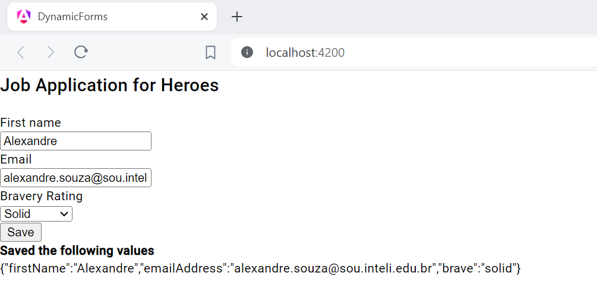

# Relatório

## Introdução

Angular é um framework que visa o desenvolvimento de aplicações web dinâmicas e responsivas. 

Este README destina-se a fornecer uma visão geral dos conceitos fundamentais do Angular aprendidos durante o desenvolvimento com este framework.

## Conceitos Aprendidos

Durante o desenvolvimento com Angular, os seguintes conceitos são fundamentais:

### Componentes
Os componentes são os blocos de construção básicos de uma aplicação Angular. Eles encapsulam a lógica de apresentação e o comportamento da interface do usuário em partes reutilizáveis e independentes. Cada componente possui seu próprio template HTML, estilos CSS e lógica TypeScript associada.

### Módulos
Os módulos em Angular são conjuntos de funcionalidades relacionadas, como componentes, diretivas e serviços. Eles ajudam a organizar a aplicação em unidades lógicas e promovem a modularidade e a reutilização do código. O módulo principal de uma aplicação Angular é chamado de módulo raiz ou AppModule.

## Projeto Rodando

## Resposta do Server com execução

